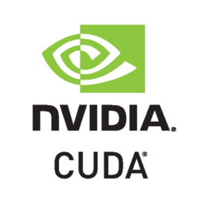
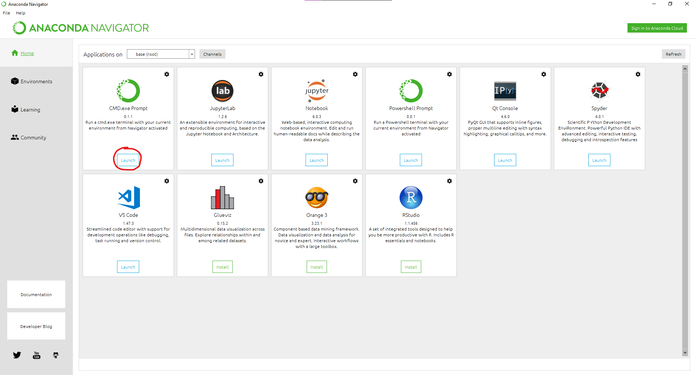
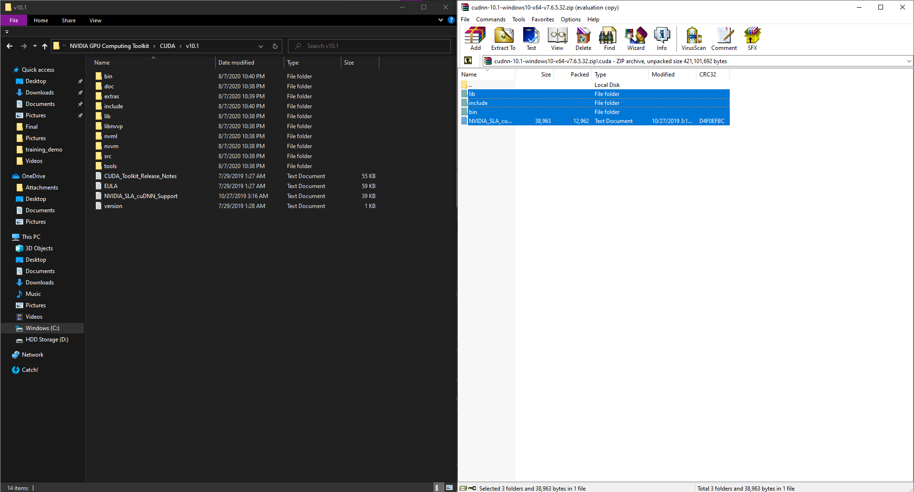
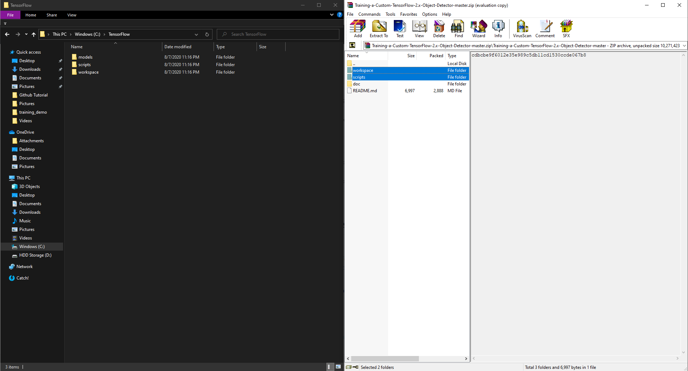
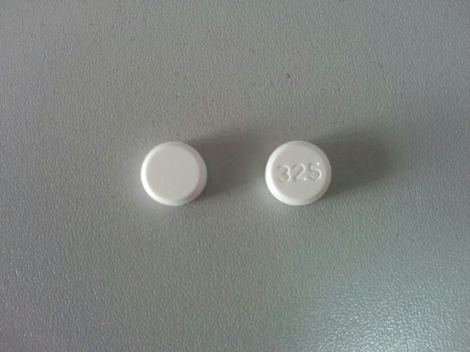
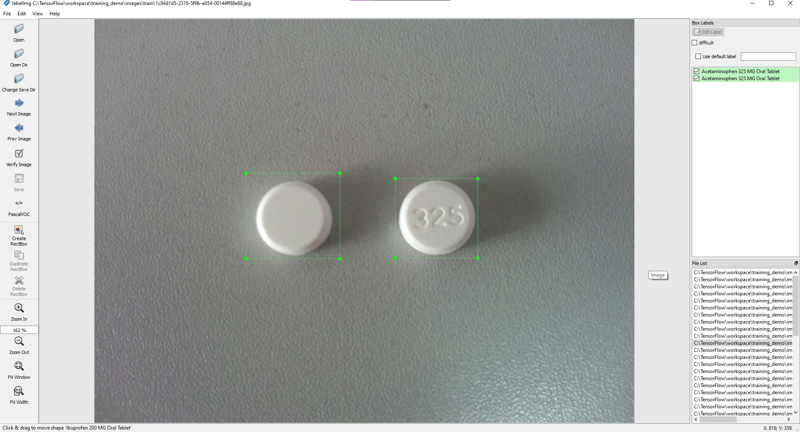
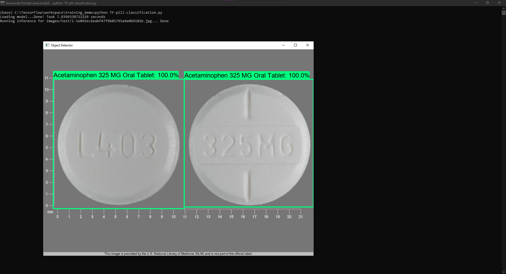

# Training-a-Custom-TensorFlow-2.X-Object-Detector
### Learn how to Train a TensorFlow Custom Object Detector with TensorFlow-GPU

This repo is a guide to use the newly introduced TensorFlow Object Detection API for training a custom object detector with TensorFlow 2.X versions. The steps mentioned mostly follow this [documentation](https://tensorflow-object-detection-api-tutorial.readthedocs.io/en/latest/training.html#), however I have simplified the steps and the process. ***As of 8/15/2020 I have tested with TensorFlow 2.3.0 to train a model on Windows 10.***

I will soon make a YouTube Tutorial which will be posted [here](https://youtu.be/oqd54apcgGE), and an extremely import step [here](https://www.youtube.com/channel/UCT9t2Bug62RDUfSBcPt0Bzg?sub_confirmation=1)!

## Table of Contents
1. [Installing TensorFlow GPU](https://github.com/armaanpriyadarshan/Training-a-Custom-TensorFlow-2.x-Object-Detector#installing-tensorflow-gpu)
2. [Preparing our Workspace and Anaconda Virtual Environment Directory Structure](https://github.com/armaanpriyadarshan/Training-a-Custom-TensorFlow-2.x-Object-Detector#preparing-our-workspace-and-anaconda-virtual-environment-directory-structure)
3. [Gathering and Labeling our Dataset](https://github.com/armaanpriyadarshan/Training-a-Custom-TensorFlow-2.x-Object-Detector#gathering-and-labeling-our-dataset)
4. [Generating Training Data](https://github.com/armaanpriyadarshan/Training-a-Custom-TensorFlow-2.x-Object-Detector#generating-training-data)
5. [Configuring the Training Pipeline](https://github.com/armaanpriyadarshan/Training-a-Custom-TensorFlow-2.x-Object-Detector#configuring-the-training-pipeline)
6. [Training the Model](https://github.com/armaanpriyadarshan/Training-a-Custom-TensorFlow-2.x-Object-Detector#training-the-model)
7. [Exporting the Inference Graph](https://github.com/armaanpriyadarshan/Training-a-Custom-TensorFlow-2.x-Object-Detector#exporting-the-inference-graph)
8. [Testing out the Finished Model](https://github.com/armaanpriyadarshan/Training-a-Custom-TensorFlow-2.x-Object-Detector#testing-out-the-finished-model)

In this repository, I have gathered and labelled my own dataset for my Pill Classification Demo that identifies two types of pills. The training data for this dataset has also been generated, and it's ready for training. If you want to try it out or get some practice with the Object Detection API, you can try training the Pill Classification Model.

<p align="center">
  
</p>

## System Requirements
When it comes to training a model, your system can heavily affect the process. The times and other figures I mention later on will be influenced by your own system specifications. My system has an Intel i5-9600KF, and more importantly an NVIDIA GeForce GTX 1660 Super with 6GBDDR6 Graphics Card Memory and 8GB of System Memory. To train with TensorFlow GPU, you need a CUDA-Enabled Graphics Card(NVIDIA GTX 650+). For more info on GPU requirements check the CUDA Docs [here](https://developer.nvidia.com/cuda-gpus).
<p align="left">
  
</p>
If you are unsure whether or not you have a compatible GPU, there are two options. The first is to use trial and error. By this I mean install the CUDA Runtime mentioned later on and see if your system is compatible. The CUDA Installer has a built-in system checker that determines your system compatibility. The second option is using Tensorflow CPU(basically just plain tensorflow), however this is significantly slower than TensorFlow-GPU but works just as well. I have not tested this, but if you decide to, follow the alternate steps I mention later on for TensorFlow CPU. You can also check if you have NVIDIA Drivers by opening Device Manager and checking your Display Adapters. If you have NVIDIA Drivers, you should be good.

## The Steps
### Installing TensorFlow GPU
The first step is to install TensorFlow-GPU. There are lots of great videos on YouTube giving more detail on how to do this and I recommend taking a look at mine above for a better visualization of how to do so. The requirements for TensorFlow-GPU are Anaconda, CUDA, and cuDNN. The last two, CUDA and cuDNN, are needed to utilize the Graphics Memory of the GPU and shift the workload. Meanwhile, Anaconda is what we will use to configure a virtual environment where we will install the necessary packages.

First let's install Anaconda by going to the [Download Page](https://www.anaconda.com/products/individual). Here, download the 64-bit graphical installer and follow the steps to finish the installation. After this is done, you should have installed the Anaconda Navigator, which you should then open. Once here, open a command prompt.
<p align="left">
  
</p>
Then create a virtual environment with this command

```
conda create -n tensorflow pip python=3.8
```

Then activate the environment with

```
conda activate tensorflow
```
**Note that whenever you open a new Anaconda Terminal you will not be in the virtual environment. So if you open a new prompt make sure to use the command above to activate the virtual environment**

Now that our Anaconda Virtual Environment is set up, we can install CUDA and cuDNN. If you plan to use TensorFlow CPU, you can skip this step and go on to the TensorFlow Installation. If you are using a different version of TensorFlow, take a look at the tested building configurations [here](https://www.tensorflow.org/install/source#tested_build_configurations). For more information about installing TensorFlow GPU check the [TensorFlow website](https://www.tensorflow.org/install/gpu).

Since you now know the correct CUDA and cuDNN versions needed for TensorFlow, we can install them from the NVIDIA Website. For TensorFlow 2.3.0, I used [cuDNN 7.6.5](https://developer.nvidia.com/compute/machine-learning/cudnn/secure/7.6.5.32/Production/10.1_20191031/cudnn-10.1-windows10-x64-v7.6.5.32.zip) and [CUDA 10.1](https://developer.nvidia.com/cuda-10.1-download-archive-base). Check the [CUDA Archive](https://developer.nvidia.com/cuda-toolkit-archive) and [cuDNN Archive](https://developer.nvidia.com/rdp/cudnn-archive) for other versions. After downloading both files, run the CUDA Installer and follow the setup wizard to install CUDA, there might be some MSBuild and Visual Studio conflicts which you should be able to resolve by installing the newest version of Visual Studio Community with MSBuild Tools. After you have successfully installed the CUDA Toolkit, find where it is installed (for me it was in C:\Program Files\NVIDIA GPU Computing Toolkit\CUDA\v10.1). Then extract the contents of the cuDNN library in to the CUDA Folder.
<p align="left">
  
</p>
Once done with this we have everything needed to install TensorFlow-GPU (or TensorFlow CPU). So we can navigate back to our anaconda prompt, and issue the following command

```
pip install tensorflow-gpu
```

If you are installing TensorFlow CPU, instead use

```
pip install tensorflow
```

Once we are done with the installation, we can use the following code to check if everything installed properly
```
python
>>> import tensorflow as tf
>>> print(tf.__version__)
```
If everything has installed properly you should get the message, "2.3.0", or whatever version of TensorFlow you have. This means TensorFlow is up and running and we are ready to setup our workspace. We can now proceed to the next step!
**Note if there is an error with importing, you must install [Visual Studio 2019 with C++ Build Tools](https://visualstudio.microsoft.com/thank-you-downloading-visual-studio/?sku=Community&rel=16).**

### Preparing our Workspace and Anaconda Virtual Environment Directory Structure
For the TensorFlow Object Detection API, there is a certain directory structure that we must follow to train our model. To make the process a bit easier, I added most of the necessary files in this repository.

Firstly, create a folder directly in C: and name it "TensorFlow". It's up to you where you want to put the folder, but you will have to keep in mind this directory path will be needed later to align with the commands. Once you have created this folder, go back to the Anaconda Prompt and switch to the folder with

```
cd C:\TensorFlow
```
Once you are here, you will have to clone the [TensorFlow models repository](https://github.com/tensorflow/models) with

```
git clone https://github.com/tensorflow/models.git
```
This should clone all the files in a directory called models. After you've done so, stay inside C:\TensorFlow and download [this](https://github.com/armaanpriyadarshan/Training-a-Custom-TensorFlow-2.X-Object-Detector/archive/master.zip) repository into a .zip file. Then extract the two files, workspace and scripts, highlighted below directly in to the TensorFlow directory.
<p align="left">
  
</p>

Then, your directory structure should look something like this

```
TensorFlow/
└─ models/
   ├─ community/
   ├─ official/
   ├─ orbit/
   ├─ research/
└─ scripts/
└─ workspace/
   ├─ training_demo/
```
After we have setup the directory structure, we must install the prequisites for the Object Detection API. First we need to install the protobuf compiler with

```
conda install -c anaconda protobuf
```
Then you should cd in to the TensorFlow\models\research directory with

```
cd models\research
```
Then compile the protos with

```
protoc object_detection\protos\*.proto --python_out=.
```
After you have done this, close the terminal and open a new Anaconda prompt. If you are using the virtual environment we created earlier, then use the following command to activate it

```
conda activate tensorflow
```
With TensorFlow 2, pycocotools is a dependency for the Object Detection API. To install it with Windows Support use

```
pip install cython
pip install git+https://github.com/philferriere/cocoapi.git#subdirectory=PythonAPI
```
**Note that Visual C++ 2015 build tools must be installed and on your path, according to the installation instructions. If you do not have this package, then download it [here](https://go.microsoft.com/fwlink/?LinkId=691126).**

Go back to the models\research directory with 

```
cd C:\TensorFlow\models\research
```

Once here, copy and run the setup script with 

```
copy object_detection\packages\tf2\setup.py .
python -m pip install .
```
If there are any errors, report an issue, but they are most likely pycocotools issues meaning your installation was incorrect. But if everything went according to plan you can test your installation with

```
python object_detection\builders\model_builder_tf2_test.py
```
You should get a similar output to this

```
[       OK ] ModelBuilderTF2Test.test_create_ssd_models_from_config
[ RUN      ] ModelBuilderTF2Test.test_invalid_faster_rcnn_batchnorm_update
[       OK ] ModelBuilderTF2Test.test_invalid_faster_rcnn_batchnorm_update
[ RUN      ] ModelBuilderTF2Test.test_invalid_first_stage_nms_iou_threshold
[       OK ] ModelBuilderTF2Test.test_invalid_first_stage_nms_iou_threshold
[ RUN      ] ModelBuilderTF2Test.test_invalid_model_config_proto
[       OK ] ModelBuilderTF2Test.test_invalid_model_config_proto
[ RUN      ] ModelBuilderTF2Test.test_invalid_second_stage_batch_size
[       OK ] ModelBuilderTF2Test.test_invalid_second_stage_batch_size
[ RUN      ] ModelBuilderTF2Test.test_session
[  SKIPPED ] ModelBuilderTF2Test.test_session
[ RUN      ] ModelBuilderTF2Test.test_unknown_faster_rcnn_feature_extractor
[       OK ] ModelBuilderTF2Test.test_unknown_faster_rcnn_feature_extractor
[ RUN      ] ModelBuilderTF2Test.test_unknown_meta_architecture
[       OK ] ModelBuilderTF2Test.test_unknown_meta_architecture
[ RUN      ] ModelBuilderTF2Test.test_unknown_ssd_feature_extractor
[       OK ] ModelBuilderTF2Test.test_unknown_ssd_feature_extractor
----------------------------------------------------------------------
Ran 20 tests in 45.304s

OK (skipped=1)
```
This means we successfully set up the Anaconda Directory Structure and TensorFlow Object Detection API. We can now finally collect and label our dataset. So, let's go on to the next step!

### Gathering and Labeling our Dataset
Since the TensorFlow Object Detection API ready to go, we must collect and label pictures that the model will be trained and tested on. All the files that will be needed from
now on will be loacated in the workspace\training_demo directory. So take a second, look around, and get used to the structure of the directory. 

- ```annotations```: This is where we will store all our training data needed for our model. By this I mean the CSV and RECORD files needed for the training pipeline. There is also a PBTXT File with the labels for our model. If you are training your own dataset you can delete train.record and test.record, but if you are training my Pill Classifier model you can keep them.
- ```exported-models```: This is our output folder where we will export and store our finished inference graph.
- ```images```: This folder consists of a test and train folder. Here we will store the labelled images needed for training and testing as you can probably infer. The labelled images consist of the original image and an XML File. If you want to train the Pill Classifier model, you can keep the images and XML documents, otherwise delete the images and XML files.
- ```models```: In this folder we will store our training pipeline and checkpoint information from the training job as well as the CONFIG file needed for training.
- ```pre-trained-models```: Here we will store our pre-trained model that we will use as a starting checkpoint for training
- The rest of the scripts are just used for training and exporting the model, as well as a sample object detection scipt that performs inference on a test image.

If you want to train a model on your own custom dataset, you must first gather images. Ideally you would want to use 100 images for each class. Say for example, you are training a cat and dog detector. You would have to gather 100 images of cats and 100 images of dogs. For images of pills, I just looked on the internet and downloaded various images. But for your own dataset, I recommend taking diverse pictures with different backgrounds and angles.
<p align="left">
  
</p>
<p align="left">
  
</p>
<p align="left">
  
</p>

After gathering some images, you must partition the dataset. By this I mean you must seperate the data in to a training set and testing set. You should put 80% of your images in to the images\training folder and put the remaining 20% in the images\test folder. After seperating your images, you can label them with [LabelImg](https://tzutalin.github.io/labelImg).


After Downloading LablelImg, configure settings such as the Open Dir and Save Dir. This let's you cycle through all the images and create bounding boxes and labels around the objects. Once you have labelled your image make sure to save and go on to the next image. Do
this for all the images in the images\test and images\train folders. 

<p align="left">
  
</p>

We have now gathered our dataset. This means we are ready to generate training data. So onwards to the next step!

### Generating Training Data

Since our images and XML files are prepared, we are ready to create the label_map. It is located in the annotations folder, so navigate to that within File Explorer. After you've located label_map.pbtxt, open it with a Text Editor of your choice. If you plan to use my Pill Classification Model, you don't need to make any changes and you can skip to configuring the pipeline. If you want to make your own custom object detector you must create a similar item for each of your labels. Since my model had two classes of pills, my labelmap looked like 
```
item {
    id: 1
    name: 'Acetaminophen 325 MG Oral Tablet'
}

item {
    id: 2
    name: 'Ibuprofen 200 MG Oral Tablet'
}
```
For example, if you wanted to make a basketball, football, and baseball detector, your labelmap would look something like
```
item {
    id: 1
    name: 'basketball'
}

item {
    id: 2
    name: 'football'
}

item {
    id: 3
    name: 'baseball'
}
```
Once you are done with this save as ```label_map.pbtxt``` and exit the text editor. Now we have to generate RECORD files for training. The script to do so is located in C:\TensorFlow\scripts\preprocessing, but we must first install the pandas package with

```
pip install pandas
```
Now we should navigate to the scripts\preprocessing directory with

```
cd C:\TensorFlow\scripts\preprocessing
```

Once you are in the correct directory, run these two commands to generate the records

```
python generate_tfrecord.py -x C:\Tensorflow\workspace\training_demo\images\train -l C:\Tensorflow\workspace\training_demo\annotations\label_map.pbtxt -o C:\Tensorflow\workspace\training_demo\annotations\train.record

python generate_tfrecord.py -x C:\Tensorflow\workspace\training_demo\images\test -l C:\Tensorflow\workspace\training_demo\annotations\label_map.pbtxt -o C:\Tensorflow\workspace\training_demo\annotations\test.record
```
 After each command you should get a success message stating that the TFRecord File has been created. So now under ```annotations``` there should be a ```test.record``` and ```train.record```. That means we have generated all the data necessary, and we can proceed to configure the training pipeline in the next step

### Configuring the Training Pipeline
For this tutorial, we will use a CONFIG File from one of the TensorFlow pre-trained models. There are plenty of models in the [TensorFlow Model Zoo](https://github.com/tensorflow/models/blob/master/research/object_detection/g3doc/tf2_detection_zoo.md), but we will use the [SSD MobileNet V2 FPNLite 640x640](http://download.tensorflow.org/models/object_detection/tf2/20200711/ssd_mobilenet_v2_fpnlite_640x640_coco17_tpu-8.tar.gz), as it is on the faster end of the spectrum with decent performance. If you want you can choose a different model, but you will have to alter the steps slightly.

To download the model you want, just click on the name in the TensorFlow Model Zoo. This should download a tar.gz file. Once it has downloaded, extracts the contents of the file to the ```pre-trained-models``` directory. The structure of that directory should now look something like this

```
training_demo/
├─ ...
├─ pre-trained-models/
│  └─ ssd_mobilenet_v2_fpnlite_640x640_coco17_tpu-8/
│     ├─ checkpoint/
│     ├─ saved_model/
│     └─ pipeline.config
└─ ...
```
Now, we must create a directory to store our training pipeline. Navigate to the ```models``` directory and create a folder called ```my_ssd_mobilenet_v2_fpnlite```. Then copy the ```pipeline.config``` from the pre-trained-model we downloaded earlier to our newly created directory. Your directory should now look something like this

```
training_demo/
├─ ...
├─ models/
│  └─ my_ssd_mobilenet_v2_fpnlite/
│     └─ pipeline.config
└─ ...
```

Then open up ```models\my_ssd_mobilenet_v2_fpnlite\pipeline.config``` in a text editor because we need to make some changes.
- Line 3. Change ```num_classes``` to the number of classes your model detects. For the basketball, baseball, and football, example you would change it to ```num_classes: 3```
- Line 135. Change ```batch_size``` according to available memory (Higher values require more memory and vice-versa). I changed it to:
  - ```batch_size: 6```
- Line 165. Change ```fine_tune_checkpoint``` to:
  - ```fine_tune_checkpoint: "pre-trained-models/ssd_mobilenet_v2_fpnlite_640x640_coco17_tpu-8/checkpoint/ckpt-0"```
- Line 171. Change ```fine_tune_checkpoint_type``` to:
  - ```fine_tune_checkpoint_type: "detection"```
- Line 175. Change ```label_map_path``` to:
  - ```label_map_path: "annotations/label_map.pbtxt"```
- Line 177. Change ```input_path``` to:
  - ```input_path: "annotations/train.record"```
- Line 185. Change ```label_map_path``` to:
  - ```label_map_path: "annotations/label_map.pbtxt"```
- Line 189. Change ```input_path``` to:
  - ```input_path: "annotations/test.record"```

Once we have made all the necessary changes, that means we are ready for training. So let's move on to the next step!
### Training the Model
Now you go back to your Anaconda Prompt. ```cd``` in to the ```training_demo``` with 

```
cd C:\TensorFlow\workspace\training_demo
```

I have already moved the training script in to the directory, so to run it just use 

```
python model_main_tf2.py --model_dir=models\my_ssd_mobilenet_v2_fpnlite --pipeline_config_path=models\my_ssd_mobilenet_v2_fpnlite\pipeline.config
```

When running the script, you should expect a few warnings but as long as they're not errors you can ignore them. Eventually when the training process starts you should see output similar to this

```
INFO:tensorflow:Step 100 per-step time 0.640s loss=0.454
I0810 11:56:12.520163 11172 model_lib_v2.py:644] Step 100 per-step time 0.640s loss=0.454
```

Congratulations! You have officially started training your model! Now you can kick back and relax as this will take a few hours depending on your system. With my specs that I mentioned earlier, training took about 2 hours. TensorFlow logs output similar to the one above every 100 steps of the process so if it looks frozen, don't worry about it. This output shows you two statistics: per-step time and loss. You're going to want to pay attention to the loss. In between logs, the loss tends to decrease. Your ideally going to want to stop the program when it's between 0.150 and 0.200. This prevents underfitting and overfitting. For me it took around 4000 steps before the loss entered that range. And then to stop the program just use CTRL+C.

### Monitoring Training with TensorBoard (Optional)

TensorFlow allows you to monitor training and visualize training metrics with TensorBoard! Keep in mind this is completely optional and wont affect the training process, so it's up to you whether you want to do it. 
First, open up a new Anaconda Prompt. Then activate the virtual environment we configured with

```
conda activate tensorflow
```

Then ```cd``` in to the ```training_demo``` directory with

```
cd C:\TensorFlow\workspace\training_demo
```
To start a TensorBoard Server, use 
 
```
tensorboard --logdir=models\my_ssd_mobilenet_v2_fpnlite
```
It should output something like this
 
```
Serving TensorBoard on localhost; to expose to the network, use a proxy or pass --bind_all
TensorBoard 2.2.2 at http://localhost:6006/ (Press CTRL+C to quit)
```

Then just open up a web browser and paste the URL given in to the search bar. This should take you to the TensorBoard Server where you can continuously monitor training!

### Exporting the Inference Graph

Once you have finished training and stopped the script, you are ready to export your finished model! You should still be in the ```training_demo``` directory but if not use

```
cd C:\TensorFlow\workspace\training_demo
```

I have already moved the script needed to export, so all you need to do is run this command

```
python .\exporter_main_v2.py --input_type image_tensor --pipeline_config_path .\models\my_ssd_mobilenet_v2_fpnlite\pipeline.config --trained_checkpoint_dir .\models\my_ssd_mobilenet_v2_fpnlite\ --output_directory .\exported-models\my_mobilenet_model
```

**Note that if you get an error similar to ```TypeError: Expected Operation, Variable, or Tensor, got block4 in exporter_main_v2.py``` look at [this](https://github.com/tensorflow/models/issues/8881) error topic**

But if this program finishes successfully, then congratulations because your model is finished! It should be located in the ```C:\TensorFlow\workspace\training_demo\exported-models\my_mobilenet_model\saved_model``` folder. There should be an PB File called ```saved_model.pb```. This is the inference graph! I also prefer to copy the ```label_map.pbtxt``` file in to this directory because it makes things a bit easier for testing. If you forgot where the labelmap is located it should be in ```C:\TensorFlow\workspace\training_demo\annotations\label_map.pbtxt```. Since the labelmap and inference graph are organized, we are ready to test! 

### Testing out the Finished Model

To test out your model, you can use the sample object detection script I provided called ```TF-image-od.py```. This should be located in ```C:\TensorFlow\workspace\training_demo```. **Update**: I have added video support, argument support, and an extra OpenCV method. The description for each program shall be listed below 
- ```TF-image-od.py```: This program uses the viz_utils module to visualize labels and bounding boxes. It performs object detection on a single image, and displays it with a cv2 window.
- ```TF-image-object-counting.py```: This program also performs inference on a single image. I have added my own labelling method with OpenCV which I prefer. It also counts the number of detections and displays it in the top left corner. The final image is, again, displayed with a cv2 window.
- ```TF-video-od.py```: This program is similar to the ```TF-image-od.py```. However, it performs inference on each individual frame of a video and displays it via cv2 window.
- ```TF-video-object-counting.py```: This program is similar to ```TF-image-object-counting.py``` and has a similar labelling method with OpenCV. Takes a video for input, and also performs object detection on each frame, displaying the detection count in the top left corner.

The usage of each program looks like 

```
usage: TF-image-opencv.py [-h] [--model MODEL] [--labels LABELS] [--image IMAGE] [--threshold THRESHOLD]

optional arguments:
  -h, --help            show this help message and exit
  --model MODEL         Folder that the Saved Model is Located In
  --labels LABELS       Where the Labelmap is Located
  --image IMAGE         Name of the single image to perform detection on
  --threshold THRESHOLD Minimum confidence threshold for displaying detected objects
```
If the model or labelmap is located anywhere other than where I put them, you can specify the location with those arguments. You must also provide an image/video to perform inference on. If you are using my Pill Detection Model, this is unecessary as the default value should be fine. If you are using one of the video scripts, use ```--video``` instead of ```--image``` and provide the path to your test video. For example, the following steps run the sample ```TF-image-od.py``` script.

```
cd C:\TensorFlow\workspace\training_demo
```

Then to run the script, just use

```
python TF-image-od.py
``` 

**Note that if you get an error similar to ```
cv2.error: OpenCV(4.3.0) C:\Users\appveyor\AppData\Local\Temp\1\pip-req-build-kv3taq41\opencv\modules\highgui\src\window.cpp:651: error: (-2:Unspecified error) The function is not implemented. Rebuild the library with Windows, GTK+ 2.x or Cocoa support. If you are on Ubuntu or Debian, install libgtk2.0-dev and pkg-config, then re-run cmake or configure script in function 'cvShowImage'
``` just run ```pip install opencv-python``` and run the program again**

If everything works properly you should get an output similar to this
<p align="center">
  
</p>

This means we're done! Over the next few weeks or months, I'll keep working on new programs and keep testing! If you find something cool, feel free to share it, as others can also learn! And if you have any errors, just raise an issue and I'll be happy to take a look at it. Congratulations, and until next time, bye!
